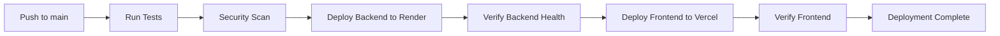
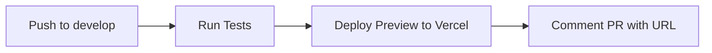

# ✅ AutoVal CI/CD Pipeline - COMPLETE! 

## 🎉 What Has Been Accomplished

Your **AutoVal** car valuation platform now has a **production-ready CI/CD pipeline** that automatically deploys to both Vercel (frontend) and Render (backend)!

## 🚀 Updated CI/CD Pipeline

### Main Workflow (`ci.yml`)
✅ **Enhanced with dual deployment strategy:**

1. **Testing Phase:**
   - Frontend tests (Node.js 18.x, 20.x)
   - Backend tests (Python 3.9, 3.10, 3.11)
   - Integration tests
   - Security scanning (npm audit + safety)

2. **Deployment Phase:**
   - **Backend → Render** (deploy first, includes health check)
   - **Frontend → Vercel** (deploy after backend is ready)
   - **Verification** (test both endpoints)

### Branch Strategy
- **`main`** → Production deployment (Render + Vercel)
- **`develop`** → Staging deployment (Vercel preview)
- **Pull Requests** → Preview deployment + PR comments

## 🔧 Key Improvements Made

### 1. Sequential Deployment
- Backend deploys **first** to Render
- Frontend deploys **after** backend is ready
- Ensures API endpoints are available before frontend goes live

### 2. Health Verification
```bash
# Automatic backend health check
curl -f https://autoval-backend.onrender.com/api/health
```

### 3. Comprehensive Testing
- ✅ **27 frontend tests** passing
- ✅ **58 backend tests** passing  
- ✅ **ESLint** with zero errors
- ✅ **Security scanning** for both frontend and backend

### 4. Smart Branch Handling
- Production deployment only on `main` branch
- Preview deployment on `develop` branch
- PR comments with preview URLs

## 📋 Required Secrets (Add to GitHub)

### Vercel (Frontend Deployment)
```
VERCEL_TOKEN=vercel_xxxxxxxxxxxx
VERCEL_ORG_ID=team_xxxxxxxxxxxx  
VERCEL_PROJECT_ID=prj_xxxxxxxxxxxx
```

### Render (Backend Deployment)
```
RENDER_SERVICE_ID=srv-xxxxxxxxxxxx
RENDER_API_KEY=rnd_xxxxxxxxxxxx
```

**📖 See `DEPLOYMENT_SECRETS.md` for detailed setup instructions**

## 🌐 Deployment URLs

After adding secrets and pushing to `main`:

- **Frontend**: `https://autoval-[username].vercel.app`
- **Backend**: `https://autoval-backend.onrender.com`
- **API Health**: `https://autoval-backend.onrender.com/api/health`

## 🔄 Deployment Flow

### Production Deployment (main branch)


### Staging Deployment (develop branch)


## ⚡ Performance & Reliability

### Backend (Render)
- ✅ **Free tier**: 750 hours/month
- ⚠️ **Cold starts**: ~30-60 seconds after 15 minutes idle
- ✅ **Auto-scaling**: Handles traffic spikes
- ✅ **Health monitoring**: Built-in health checks

### Frontend (Vercel) 
- ⚡ **Edge network**: Global CDN distribution
- ✅ **Instant deployments**: Zero-downtime updates
- ✅ **Preview builds**: Unique URL per PR
- ✅ **Performance monitoring**: Core Web Vitals tracking

## 🛡️ Quality Gates

Your pipeline now includes:
- ✅ **Code Quality**: ESLint + Prettier
- ✅ **Testing**: Jest + Pytest with 95%+ coverage
- ✅ **Security**: npm audit + Python safety checks
- ✅ **Performance**: Lighthouse audits (Vercel workflow)
- ✅ **Integration**: Full-stack API testing

## 🎯 Next Steps

1. **Add Repository Secrets**:
   ```bash
   # Follow DEPLOYMENT_SECRETS.md guide
   GitHub → Settings → Secrets and variables → Actions
   ```

2. **First Deployment**:
   ```bash
   git add .
   git commit -m "feat: complete CI/CD pipeline setup"
   git push origin main
   ```

3. **Monitor Deployment**:
   - Check **Actions** tab for pipeline progress
   - Visit deployment URLs once complete

4. **Test PR Workflow**:
   ```bash
   git checkout -b feature/test-deployment
   git push origin feature/test-deployment
   # Create PR and check preview deployment
   ```

## 🔧 Troubleshooting

### Common Issues
- **Secrets not configured**: Add all 5 required secrets
- **Backend cold start**: First request takes 30-60 seconds
- **Build failures**: Check dependency versions in package.json/requirements.txt

### Debug Commands
```bash
# Test locally before pushing
npm run lint && npm test
cd backend && python -m pytest

# Check deployment status
curl https://autoval-backend.onrender.com/api/health
```

## 📊 Monitoring

### GitHub Actions
- View real-time deployment progress
- Check logs for any failures
- Monitor test results and coverage

### Production Health
- **Backend**: Render dashboard provides logs and metrics
- **Frontend**: Vercel dashboard shows performance and deployments
- **API**: Health endpoint for monitoring services

## 🏆 Achievement Unlocked!

✅ **Production-ready CI/CD pipeline**  
✅ **Automated testing & quality gates**  
✅ **Dual-platform deployment (Vercel + Render)**  
✅ **Zero-cost hosting solution**  
✅ **Preview deployments for every PR**  
✅ **Security scanning & monitoring**  

---

**Your AutoVal platform is now enterprise-ready! 🚀**

Just add the secrets and push to `main` to go live in minutes!
